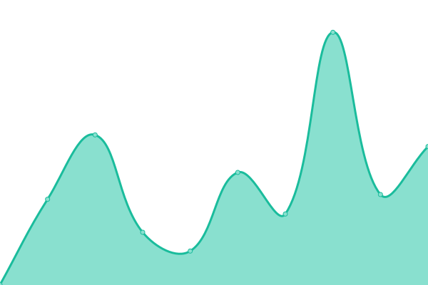

# [📈 Live Status](https://uptime.we-dev.xyz): <!--live status--> **🟩 All systems operational**

This repository contains the open-source uptime monitor and status page for [we-dev.xyz](https://uptime.we-dev.xyz), powered by [Upptime](https://github.com/upptime/upptime).

With [Upptime](https://upptime.js.org), you can get your own unlimited and free uptime monitor and status page, powered entirely by a GitHub repository. We use [Issues](https://github.com/cookie-org/web-uptime/issues) as incident reports, [Actions](https://github.com/cookie-org/web-uptime/actions) as uptime monitors, and [Pages](https://uptime.we-dev.xyz) for the status page.

<!--start: status pages-->
<!-- This summary is generated by Upptime (https://github.com/upptime/upptime) -->
<!-- Do not edit this manually, your changes will be overwritten -->
<!-- prettier-ignore -->
| URL | Status | History | Response Time | Uptime |
| --- | ------ | ------- | ------------- | ------ |
|  DSMR AH | 🟩 Up | [dsmr-ah.yml](https://github.com/cookie-org/web-uptime/commits/HEAD/history/dsmr-ah.yml) | 

 3480ms
     
 | 

<a href="https://uptime.we-dev.xyz/history/dsmr-ah">98.72%</a>
    

|  DSMR ECK | 🟩 Up | [dsmr-eck.yml](https://github.com/cookie-org/web-uptime/commits/HEAD/history/dsmr-eck.yml) | 

 713ms
     
 | 

<a href="https://uptime.we-dev.xyz/history/dsmr-eck">98.72%</a>
    

|  DSMR WS | 🟩 Up | [dsmr-ws.yml](https://github.com/cookie-org/web-uptime/commits/HEAD/history/dsmr-ws.yml) | 

 630ms
     
 | 

<a href="https://uptime.we-dev.xyz/history/dsmr-ws">98.72%</a>
    

|  Unifi Controller | 🟩 Up | [unifi-controller.yml](https://github.com/cookie-org/web-uptime/commits/HEAD/history/unifi-controller.yml) | 

 525ms
     
 | 

<a href="https://uptime.we-dev.xyz/history/unifi-controller">98.73%</a>
    

|  Home Assistant | 🟩 Up | [home-assistant.yml](https://github.com/cookie-org/web-uptime/commits/HEAD/history/home-assistant.yml) | 

 446ms
     
 | 

<a href="https://uptime.we-dev.xyz/history/home-assistant">100.00%</a>
    

|  Vault | 🟩 Up | [vault.yml](https://github.com/cookie-org/web-uptime/commits/HEAD/history/vault.yml) | 

 450ms
     
 | 

<a href="https://uptime.we-dev.xyz/history/vault">100.00%</a>
    

|  Prowlarr | 🟩 Up | [prowlarr.yml](https://github.com/cookie-org/web-uptime/commits/HEAD/history/prowlarr.yml) | 

 604ms
     
 | 

<a href="https://uptime.we-dev.xyz/history/prowlarr">100.00%</a>
    

|  SRV01 | 🟩 Up | [srv-01.yml](https://github.com/cookie-org/web-uptime/commits/HEAD/history/srv-01.yml) | 

 252ms
     
 | 

<a href="https://uptime.we-dev.xyz/history/srv-01">100.00%</a>
    

|  SRV02 | 🟩 Up | [srv-02.yml](https://github.com/cookie-org/web-uptime/commits/HEAD/history/srv-02.yml) | 

 269ms
     
 | 

<a href="https://uptime.we-dev.xyz/history/srv-02">98.74%</a>
    

|  SRV03 | 🟩 Up | [srv-03.yml](https://github.com/cookie-org/web-uptime/commits/HEAD/history/srv-03.yml) | 

 266ms
     
 | 

<a href="https://uptime.we-dev.xyz/history/srv-03">100.00%</a>
    

|  SRV04 | 🟩 Up | [srv-04.yml](https://github.com/cookie-org/web-uptime/commits/HEAD/history/srv-04.yml) | 

 275ms
     
 | 

<a href="https://uptime.we-dev.xyz/history/srv-04">100.00%</a>
    

<!--end: status pages-->

[**Visit our status website →**](https://uptime.we-dev.xyz)

## 📄 License

- Powered by: [Upptime](https://github.com/upptime/upptime)
- Code: [MIT](./LICENSE) © [Bas Wijngaarden](https://uptime.we-dev.xyz)
- Data in the `./history` directory: [Open Database License](https://opendatacommons.org/licenses/odbl/1-0/)
